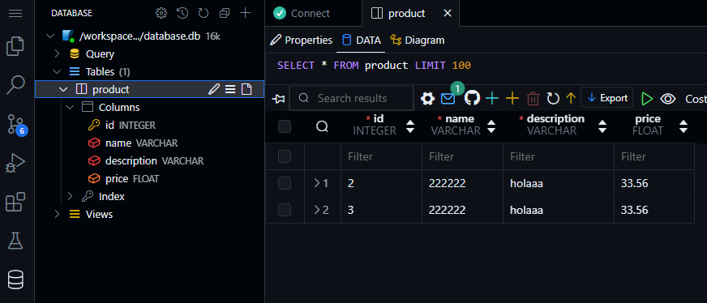

## Conectarse a la base de datos local (sqlite)

Si estamos utilizando la base de datos local (no remota) de SQLite (la que usamos para probar), podemos conectarnos desde la herramienta "Database Client" de la siguiente manera:

> Si no la tenemos instalada, instalar yendo a la pestaña de extensiones, y buscar el código de extensión:

`cweijan.vscode-database-client2`

---

Para conectarse, abrir la extensión, seleccionar "New connection", seleccionar "SQLite" en el tipo de servidor. En el apartado de "path" colocar la ruta al archivo de nuestra base de datos local:

### Conexión lista:
